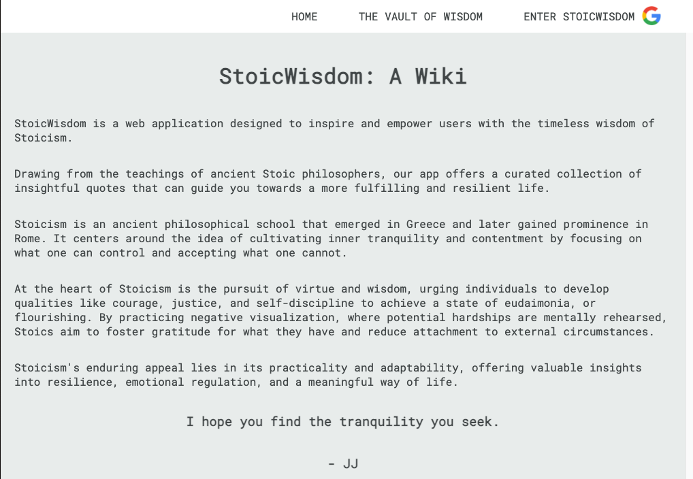

# stoic-wisdom-a-wiki
About

StoicWisdom is a web application designed to inspire and empower users with the timeless wisdom of Stoicism. Drawing from the teachings of ancient Stoic philosophers, our app offers a curated collection of insightful quotes that can guide you towards a more fulfilling and resilient life.

Stoicism is an ancient philosophical school that emerged in Greece and later gained prominence in Rome. It centers around the idea of cultivating inner tranquility and contentment by focusing on what one can control and accepting what one cannot. At the heart of Stoicism is the pursuit of virtue and wisdom, urging individuals to develop qualities like courage, justice, and self-discipline to achieve a state of eudaimonia, or flourishing. By practicing negative visualization, where potential hardships are mentally rehearsed, Stoics aim to foster gratitude for what they have and reduce attachment to external circumstances. Stoicism's enduring appeal lies in its practicality and adaptability, offering valuable insights into resilience, emotional regulation, and a meaningful way of life.

Personal Note

I created this web app as my first full-stack CRUD project during General Assembly's Software Engineering Immersive bootcamp.

Stoicism has been immensely beneficial in helping me navigate my career and personal life during my life's journey. 

I am an individual that is constantly seeing wisdom to help navigate our modern world.

I find myself constantly pondering the deeper meanings behind the quotes I read, so I figured I would combine my interests of Stoicism and technology to build "StoicWisdom: A Wiki". 

Getting Started

Deploy StoicWisdom here: https://stoicwisdom-f72934c2e06a.herokuapp.com/!

Explore Stoic Wisdom: Dive into a vast library of Stoic quotes from renowned philosophers like Seneca, Epictetus, and Marcus Aurelius. Each quote is carefully selected to provide practical advice on how to navigate life's challenges and find inner peace.

Share Your Interpretation: Share your interpretations of a quote or share how a quote has helped you navigate your own life via commenting.

Personal Quote Journal: Create an account to save and organize your favorite quotes. Build your personal collection of Stoic wisdom, revisit them whenever needed, and track your personal growth journey.

Share the Wisdom: Share your favorite quotes on social media to spread Stoic insights with your friends and followers. Inspire others to embrace the Stoic philosophy and its transformative power.

Technologies used: HTML, CSS, JavaScript, MongoDB, Mongoose, Express, Heroku

Next Steps & Ice Box Items:

Join the StoicWisdom Community

At StoicWisdom, we believe in the enduring relevance of Stoicism and its ability to transform lives. Whether you're new to Stoicism or a seasoned practitioner, our web app is here to accompany you on your journey to self-discovery, resilience, and inner wisdom.

Are you ready to embrace Stoic teachings and unlock your full potential? Begin your exploration of StoicWisdom today and discover the profound impact these ancient quotes can have on your life.

Visit StoicWisdom now and embark on a path of inner strength and serenity. 

The wisdom of the ages is just a click away.